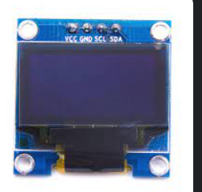

## Quantum
ATmega328P based stopwatch

### Контроллер

Секумендомер построен на контроллере **AVR ATmega328P (DIP-28)** c внешним кварцои 16Mhz.

### Управление 
Для настройки различных параметров секундомера используется 3 кнопки и 3 светодиода

### OLED дисплей

Для работы с OLED используется библиотека для монохромных дисплеев [U8g2](https://github.com/olikraus/u8g2/wiki). На плате установлен [**OLED 0.96" 128x64(I2C) с контроллером SSD1306**](https://robototehnika.ru/e-store/catalog/342/2569/)

### Питание платы
На плате установлен линейный стабилизатор на 5V. Входное наряжение 7.4V(2S Lipo аккумулятор). Для контроля заряда акумулятора используется делитель напряжения

### ИК Датчики

Возможность подключения двух [**ИК датчиков**](https://robototehnika.ru/e-store/catalog/409/831/). Выходные сигналы датчиков заведены на входы внешних прерываний контроллера, что обеспечивает мгновенную обработку изменений сигнала.